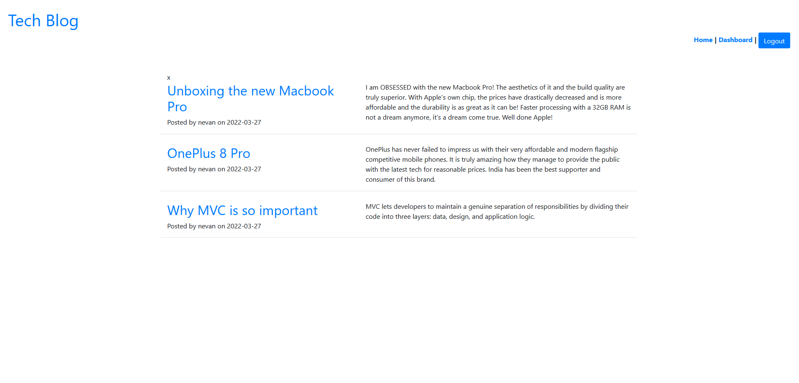
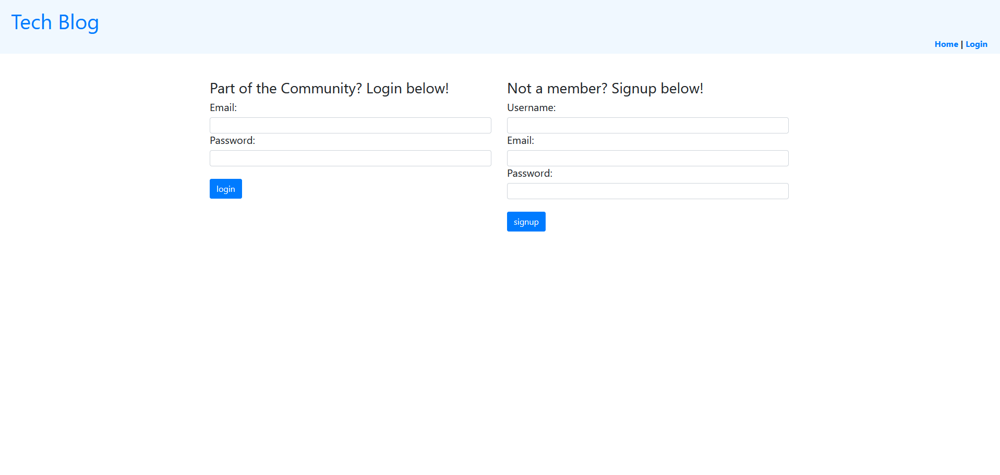
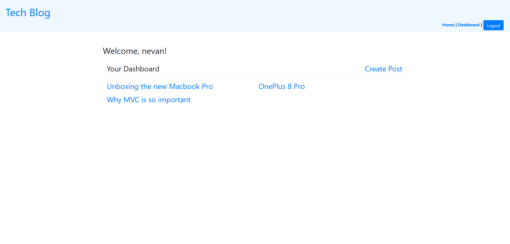
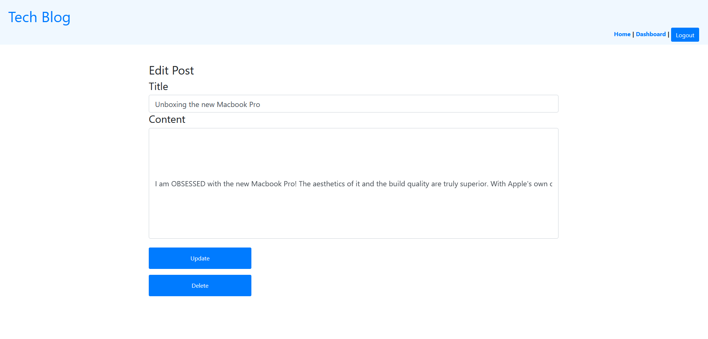

# TechBlog
## Table of Contents
* [Description](#desc)  
* [Installation](#install)  
* [Usage](#usage)  
* [Credits](#credits)  
* [License](#license)  
* [Github](#github)  

## Description

It's just as vital to write about technology as it is to make it. Most developers spend at least some of their time researching and writing about technical concepts, current breakthroughs, and new technologies, in addition to building new applications and troubleshooting old code bases.

This website was created from the ground up and is hosted on Heroku. Using Handlebars, the application follows the MVC paradigm. The template language is js, the ORM is Sequelize, and authentication is handled via the express-session npm package.

## Installation
Follow the link in the GitHub section below to the deployed application on Heroku.
 
 
## Usage
The following image shows the application's appearance and functionality.

The application should appear as follows after loading:

The application should appear as follows on the Login page:

The application should appear as follows after successfully creating an account:

The application should appear as follows to edit a post:

 
## License
Copyright [2022] [Nevan D'Souza]

Licensed under the Apache License, Version 2.0 (the "License"); you may not use this file except in compliance with the License.
You may obtain a copy of the License at http://www.apache.org/licenses/LICENSE-2.0.

Unless required by applicable law or agreed to in writing, software
distributed under the License is distributed on an "AS IS" BASIS,
WITHOUT WARRANTIES OR CONDITIONS OF ANY KIND, either express or implied.
See the License for the specific language governing permissions and
limitations under the License.

 
## GitHub
Github: nevan-dsouza  
Deployed Application on Heroku: 